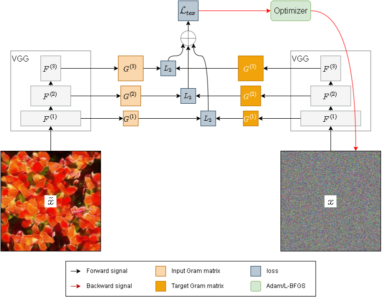
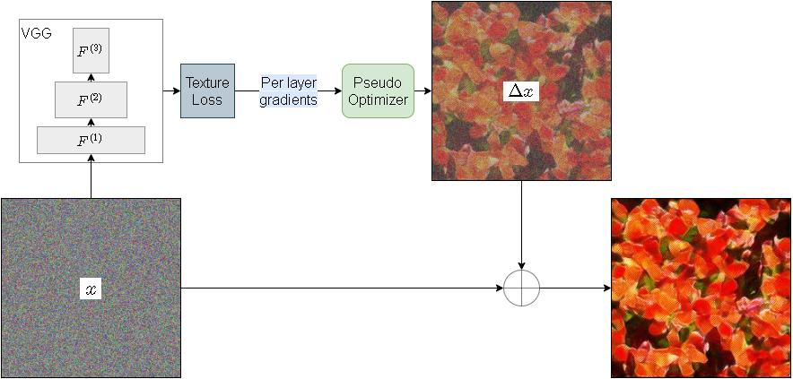

# SynTex: Synthesize Textures Using Deep Neural Networks

## Installation
### Prerequisites
This project requires the following dependencies
* python=3.6
* [tensorpack](https://github.com/tensorpack/tensorpack)=0.9.8
* tensorflow=1.12
* python bindings for opencv

Run the following installation steps to use on GPU (March 2024):
* conda create -n syntex python=3.6 cudatoolkit=9.0
* conda install tensorflow-gpu=1.12
* pip install tensorpack==0.9.8
* pip install opencv-python==3.4.2.17

### Installation
Clone this project 
```
git clone https://github.com/swift-n-brutal/syntex.git
```

Add the path that contains this project (e.g. path/to/syntex) to your `PYTHONPATH`
```
export PYTHONPATH=$PYTHONPATH:path/to
```

To run the Progressive model, use the following command:
```
python progressive_model.py
```

Load trained models (the two files starting by model-{number of iterations}, which are insided train_log/single_model) and the json file (with training statistics) to the Models/your_model folder.

Use plot_progressive.py to plot the output image. Select the right paths to find your model.

Use Models/plots.py to plot losses and other metrics. Select your model.

## Methods
### [gatys](gatys)
An optimization based method proposed by [Gatys et al.](https://arxiv.org/pdf/1505.07376v3.pdf)

### [po](po)
Fast Texture Synthesis via Pseudo Optimizer. [Paper](https://openaccess.thecvf.com/content_CVPR_2020/html/Shi_Fast_Texture_Synthesis_via_Pseudo_Optimizer_CVPR_2020_paper.html)

